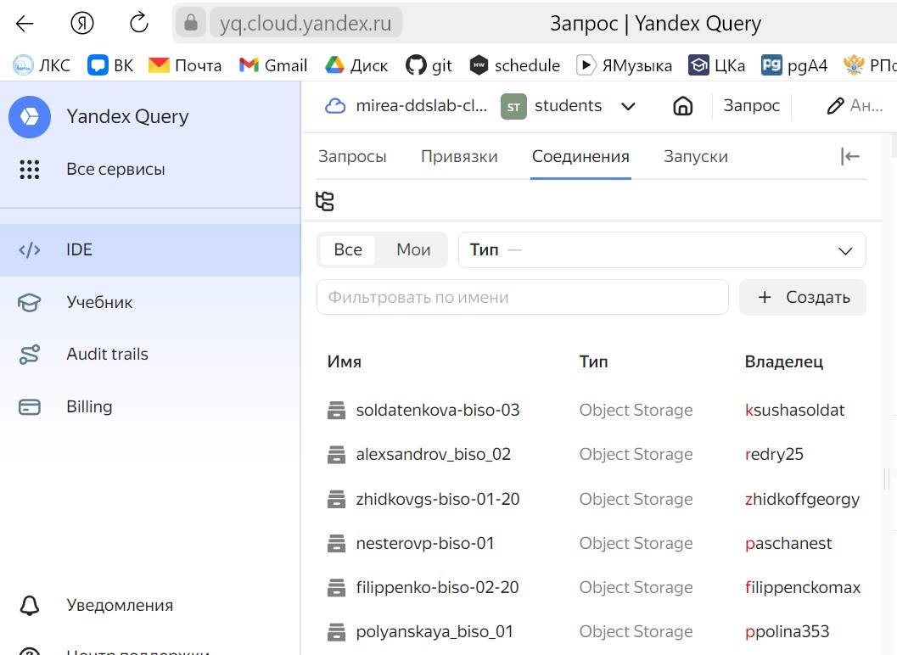
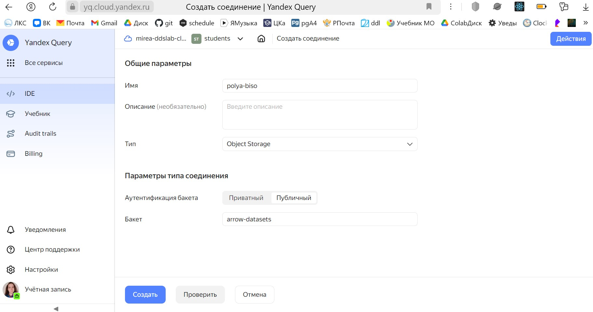
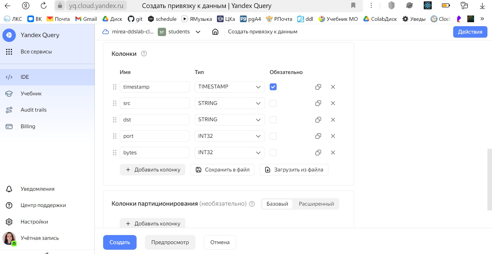
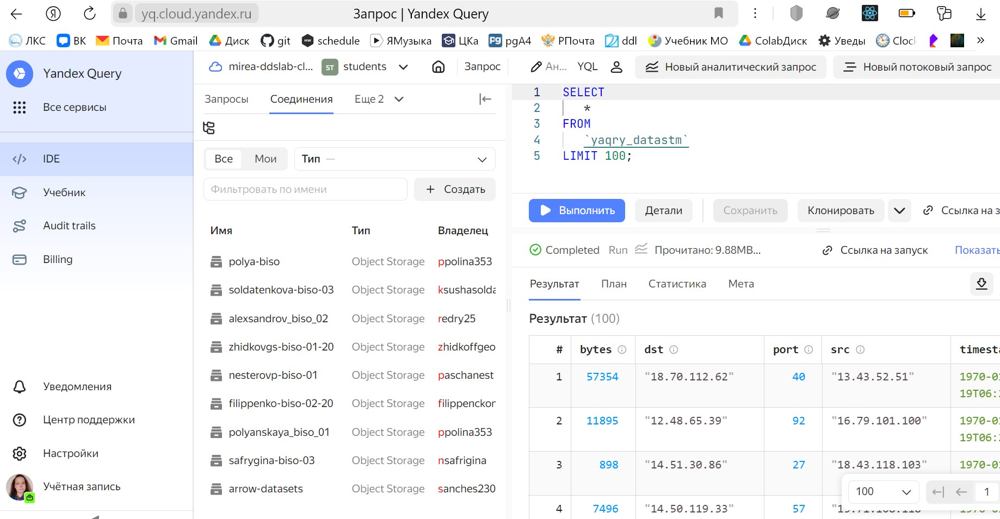
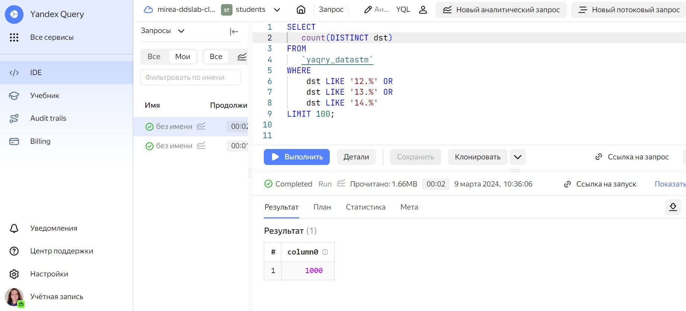
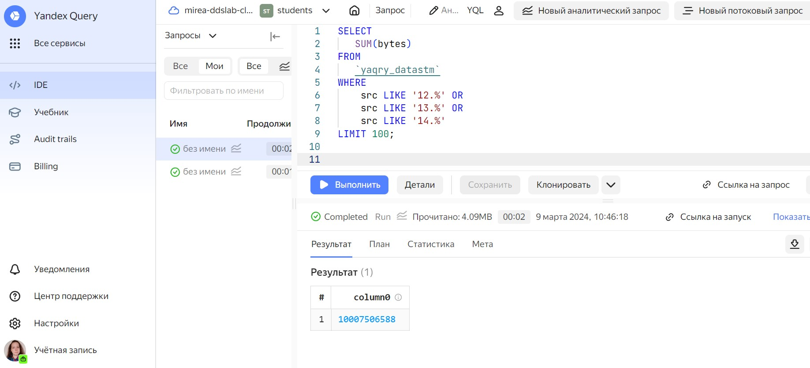
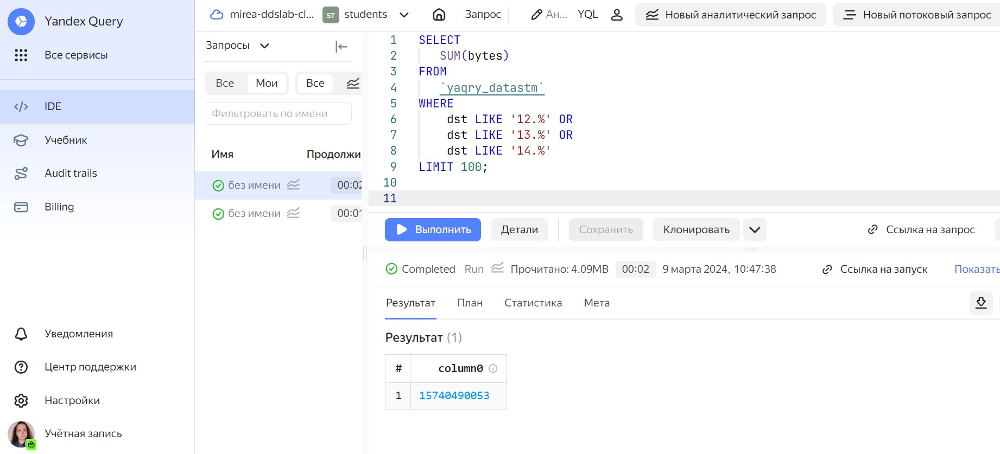

# lab1
Полянская Полина Алексеевна

Использование технологии Yandex Query для анализа данных сетевой
активности

## Цель

1.  Изучить возможности технологии Yandex Query для анализа
    структурированных наборов данных
2.  Получить навыки построения аналитического пайплайна для анализа
    данных с помощью сервисов Yandex Cloud
3.  Закрепить практические навыки использования SQL для анализа данных
    сетевой активности в сегментированной корпоративной сети

## Исходные данные

1.  Ноутбук с ОС Windows 10
2.  RStudio
3.  Yandex Cloud
4.  Yandex Query

## Задание

Используя сервис Yandex Query настроить доступ к данным, хранящимся в
сервисе хранения данных Yandex Object Storage. При помощи
соответствующих SQL запросов ответить на вопросы.

### 1. Проверить доступность данных в Yandex Object Storage

Для проверки нужно ввести адрес:

    https://storage.yandexcloud.net/<Имя-Бакета>/<имя-файла>

В данном случае:

    https://storage.yandexcloud.net/arrow-datasets/yaqry_dataset.pqt

Больше информация об адресации:

    https://cloud.yandex.ru/ru/docs/storage/concepts/bucket#bucket-url


### 2. Подключить бакет как источник данных для Yandex Query

Для этого нужно зайти в Yandex Query -\> Соединения -\> Создать



Далее нужно заполнить поля с учетом допустимых символов, выбрать тип
аутентификации – публичный. Ввести имя бакета в соответствующее поле и
сохранить.



Теперь, после создания соединения, нужно указать, какой объект
использовать в качестве источника данных. Для этого нужно сделать
привязку данных.


Описание состава и формата входных данных представлено ниже.

    SCHEMA=(
    timestamp TIMESTAMP NOT NULL,
    src STRING,
    dst STRING,
    port INT32,
    bytes INT32
    )



Если настройки сделаны правильно, то запрос покажет таблицу.



## Анализ

### 1. Известно, что IP адреса внутренней сети начинаются с октетов, принадлежащих интервалу \[12-14\]. Определите количество хостов внутренней сети, представленных в датасете.



``` r
sprintf("1000")
```

    [1] "1000"

### 2. Определите суммарный объем исходящего трафика



``` r
sprintf("10007506588")
```

    [1] "10007506588"

### 3. Определите суммарный объем входящего трафика



``` r
sprintf("15740490053")
```

    [1] "15740490053"

## Оценка результатов

Был проведен анализ сетевой активности с помощью SQL и Yandex Cloud.

## Вывод

Была осуществлена работа с системой Yandex Cloud и сервисами внутри неё.
Были решены задачи с помощью языка SQL.
